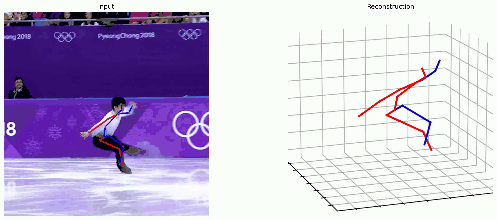

# PoseMamba: Monocular 3D Human Pose Estimation with Bidirectional Spatio-Temporal State Space Model

<p align="center">
  
</p>

<p align="center">
  <a href="https://github.com/nankingjing/PoseMamba/stargazers"></a>
  <a href="https://github.com/nankingjing/PoseMamba/releases/tag/v1.0.0"></a>
  <a href="https://huggingface.co/nankingjings/PoseMamba-weights"></a>
  <a href="https://huggingface.co/spaces/nankingjings/PoseMamba-Demo"></a>
  <a href="https://pytorch.org/get-started/locally/"></a>
  <a href="https://ojs.aaai.org/index.php/AAAI/article/view/32401"></a>
  <a href="https://arxiv.org/abs/2408.03540"></a>
  <a href="LICENSE"></a>
</p>

<p align="center">
  <b>Official PyTorch implementation</b> · AAAI 2025 · Linear-complexity Mamba for 3D human pose estimation
</p>

> **Having trouble installing or reproducing results?** See the pinned [**Installation & FAQ**](https://github.com/nankingjing/PoseMamba/discussions/21) discussion before opening an issue.

---

## Highlights

- **First** bidirectional global-local spatio-temporal **SSM/Mamba** design for monocular **3D HPE** (2D-to-3D lifting).
- **SOTA on Human3.6M & MPI-INF-3DHP** with **fewer parameters and MACs** than Transformer baselines.
- **PoseMamba-L**: **38.1 mm** MPJPE on H36M (P1, detected 2D), only **6.7M** params / **27.9G** MACs.
- **2.8× faster** than MotionAGFormer; **64.7% less GPU memory** at 243-frame batch inference (see paper).
- In-the-wild **demo** with 2D detector + 3D lifting pipeline.

> **Paper**: [AAAI 2025](https://ojs.aaai.org/index.php/AAAI/article/view/32401) · [arXiv](https://arxiv.org/abs/2408.03540) · [PDF](https://arxiv.org/pdf/2408.03540v2)

## Results on Human3.6M (243 frames, MPJPE ↓)

| Method | Params | MACs | P1 (2D det) | P1 (GT 2D) |
|--------|--------|------|-------------|------------|
| MixSTE | 33.6M | 139.0G | 40.9 | 21.6 |
| MotionBERT | 42.3M | 174.8G | 39.2 | 17.8 |
| MotionAGFormer-L | 7.9M | 33.0G | 38.4 | 17.3 |
| **PoseMamba-L (ours)** | **6.7M** | **27.9G** | **38.1** | **15.6** |
| PoseMamba-B | 3.4M | 13.9G | 40.8 | 16.8 |
| PoseMamba-S | 0.9M | 3.6G | 41.8 | 20.0 |

## Quick Start

### 1. Environment

Tested with Python 3.8.5, PyTorch 1.13.1+cu117, CUDA 11.7.

```bash
conda create -n posemamba python=3.8.5
conda activate posemamba
pip install torch==1.13.1+cu117 torchvision==0.14.1+cu117 torchaudio==0.13.1 --extra-index-url https://download.pytorch.org/whl/cu117
pip install -r requirements.txt
cd kernels/selective_scan && pip install -e . && cd ../..
```

> **Important**: `kernels/selective_scan` must compile successfully. If you see `selective_scan_cuda_core is not defined`, rebuild the CUDA extension (see [FAQ](#faq)).

### 2. Demo (in-the-wild video)

1. Download YOLOv3 + HRNet weights → `./demo/lib/checkpoint/` ([Google Drive](https://drive.google.com/drive/folders/1_ENAMOsPM7FXmdYRbkwbFHgzQq_B_NQA?usp=sharing))
2. Download demo 3D lifting checkpoint → `./checkpoint/` ([link](https://drive.google.com/file/d/1Iii5EwsFFm9_9lKBUPfN8bV5LmfkNUMP/view))
3. Optional: download sample assets ([link](https://drive.google.com/file/d/1hbK1HDz1nMTGYcczOC5r33Mk8nAtLZCr/view?usp=sharing)) and unzip
4. Run:

```bash
python vis.py --video sample_video.mp4 --gpu 0
```

Or use `demo.sh` after placing your video under `./demo/video/`.

**Try online**: [Hugging Face Demo Space](https://huggingface.co/spaces/nankingjings/PoseMamba-Demo) · [Colab notebook](notebooks/PoseMamba_Demo.ipynb)

## Dataset

### Human3.6M

1. Download MotionBERT preprocessed H3.6M data ([OneDrive](https://1drv.ms/u/s!AvAdh0LSjEOlgU7BuUZcyafu8kzc?e=vobkjZ) or [Google Drive](https://drive.google.com/file/d/1WWoVAae7YKKKZpa1goO_7YcwVFNR528S/view?usp=sharing)) → `data/motion3d/`
2. Slice clips:

```bash
cd tools && python convert_h36m.py && cd ..
```

Expected layout: `data/motion3d/MB3D_f243s81/` with `h36m_sh_conf_cam_source_final.pkl` (see config `data_root`).

### MPI-INF-3DHP

Follow [MotionAGFormer](https://github.com/taatiteam/motionagformer) for dataset setup.

## Training

Config files are under **`configs/pose3d/`** (not `configs/h36m`).

```bash
# Example: PoseMamba-S on Human3.6M
CUDA_VISIBLE_DEVICES=0 python train.py \
  --config configs/pose3d/PoseMamba_train_h36m_S.yaml \
  --checkpoint checkpoint/pose3d/PoseMamba_train_h36m_S
```

See `train.sh` for S/B/L variants.

## Evaluation

### Option A: Released `.pth.tr` weights (Google Drive)

Download from **Hugging Face** (recommended) or Google Drive:

| Model | Params | Hugging Face | Google Drive |
|-------|--------|--------------|--------------|
| PoseMamba-S | 0.9M | [HF](https://huggingface.co/nankingjings/PoseMamba-weights/blob/main/PoseMamba_S.bin) | [link](https://drive.google.com/file/d/1LZtEjeiAIx6LXFmjoyKKzbaCPV3R1-P7/view?usp=sharing) |
| PoseMamba-B | 3.4M | [HF](https://huggingface.co/nankingjings/PoseMamba-weights/blob/main/PoseMamba_B.bin) | [link](https://drive.google.com/file/d/1aP6WAq5fKNIqyYcI_ZnYbuagR3_zVik2/view?usp=sharing) |
| PoseMamba-L | 6.7M | [HF](https://huggingface.co/nankingjings/PoseMamba-weights/blob/main/PoseMamba_L.bin) | [link](https://drive.google.com/file/d/16_Tg0Aqzgih243_dflyFv0UB79gU9u8q/view?usp=sharing) |

**All models**: [nankingjings/PoseMamba-weights](https://huggingface.co/nankingjings/PoseMamba-weights) · [Google Drive bundle](https://drive.google.com/file/d/1WFRAeal8W6ntrTPNrf-SNywdgupj0-S8/view?usp=sharing)

Place weights under `checkpoint/` and run evaluation following the training checkpoint layout in `eval.sh`.

### Option B: Evaluate a training run (`.bin` checkpoint)

After training, checkpoints are saved as **`best_epoch.bin`** / **`latest_epoch.bin`**:

```bash
CUDA_VISIBLE_DEVICES=0 python train.py \
  --config checkpoint/pose3d/PoseMamba_B/config.yaml \
  --evaluate checkpoint/pose3d/PoseMamba_B/best_epoch.bin \
  --checkpoint eval/checkpoint
```

> Note: training saves `.bin` files; released Google Drive weights may use `.pth.tr`. Use the format that matches your download.

## FAQ

<details>
<summary><b>selective_scan_cuda_core is not defined</b></summary>

Rebuild the CUDA kernel with the same PyTorch/CUDA version as your runtime:

```bash
cd kernels/selective_scan
pip uninstall selective-scan -y 2>/dev/null || true
pip install -e .
cd ../..
```

Ensure `nvcc` matches CUDA 11.7 if using the default PyTorch build.
</details>

<details>
<summary><b>Dataset not found / 训练时数据集找不到</b></summary>

Check `data_root` in your yaml (e.g. `data/motion3d/MB3D_f243s81/`). Run `tools/convert_h36m.py` after downloading preprocessed data. The folder must contain the pickle file named in the config (`dt_file`).
</details>

<details>
<summary><b>Evaluation command / checkpoint format confusion</b></summary>

- **Training output**: `--evaluate path/to/best_epoch.bin` (see `eval.sh`)
- **Released weights**: may be `.pth.tr` from Google Drive; load according to your local checkpoint layout
- There is **no** `--eval-only` flag in the current `train.py`
</details>

<details>
<summary><b>Results gap vs paper</b></summary>

Common causes: wrong data split, not using flip test (`flip: True` in config), mismatched 2D detections, or selective_scan not built correctly. Please open an issue with your config, checkpoint, and log output.
</details>

<details>
<summary><b>How are MACs computed?</b></summary>

MACs follow the protocol in our paper (per-frame multiply-accumulate operations), comparable to MotionBERT / MotionAGFormer reporting.
</details>

## Project structure

```
PoseMamba/
├── configs/pose3d/     # Training configs (S / B / L)
├── lib/model/          # PoseMamba backbone
├── kernels/selective_scan/  # CUDA SSM kernel (required)
├── tools/              # Dataset preprocessing
├── vis.py              # In-the-wild demo
└── train.py            # Train & evaluate
```

## Acknowledgement

Code builds on [MotionBERT](https://github.com/Walter0807/MotionBERT), [MotionAGFormer](https://github.com/taatiteam/MotionAGFormer), [P-STMO](https://github.com/paTRICK-swk/P-STMO), [MHFormer](https://github.com/Vegetebird/MHFormer), and [VMamba](https://github.com/mzeromiko/vmamba). Thank you for open-sourcing.

## Citation

If you find PoseMamba useful, please cite:

```bibtex
@inproceedings{huang2025posemamba,
  title={PoseMamba: Monocular 3D Human Pose Estimation with Bidirectional Global-Local Spatio-Temporal State Space Model},
  author={Huang, Yunlong and Liu, Junshuo and Xian, Ke and Qiu, Robert Caiming},
  booktitle={Proceedings of the AAAI Conference on Artificial Intelligence},
  year={2025}
}
```

## Contact

Issues & questions: [Installation & FAQ](https://github.com/nankingjing/PoseMamba/discussions/21) · [GitHub Issues](https://github.com/nankingjing/PoseMamba/issues) · Author: [Yunlong Huang](https://scholar.google.com/citations?user=u2QDgXkAAAAJ&hl=zh-CN)
